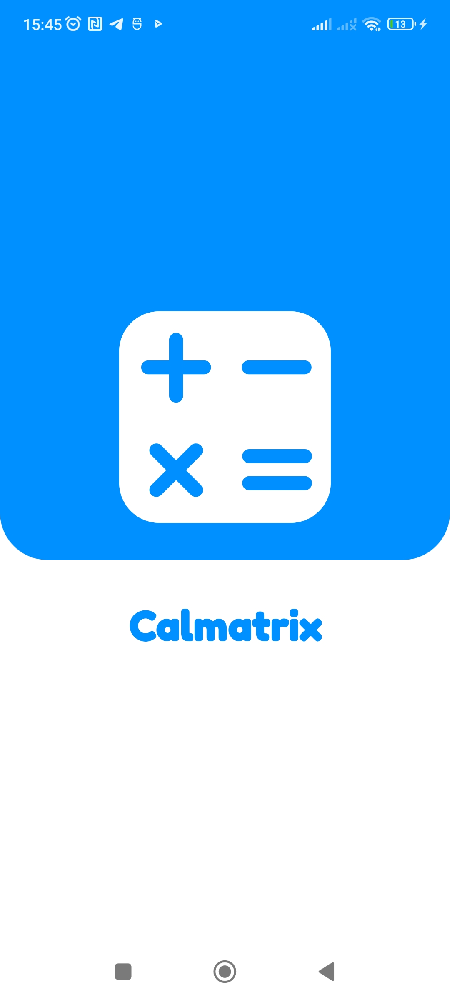
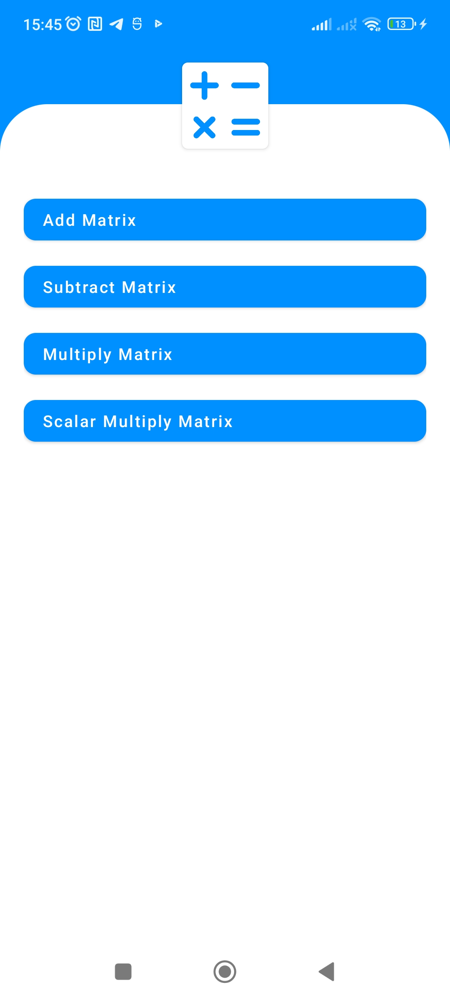
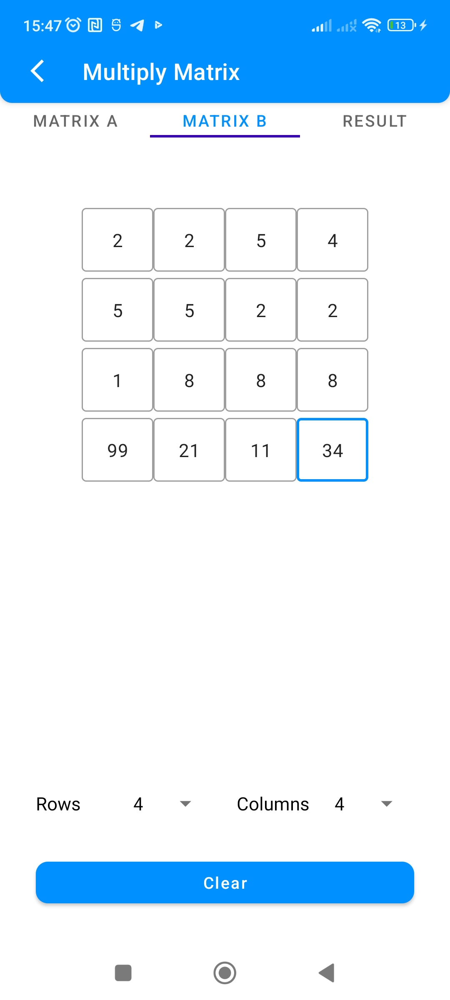
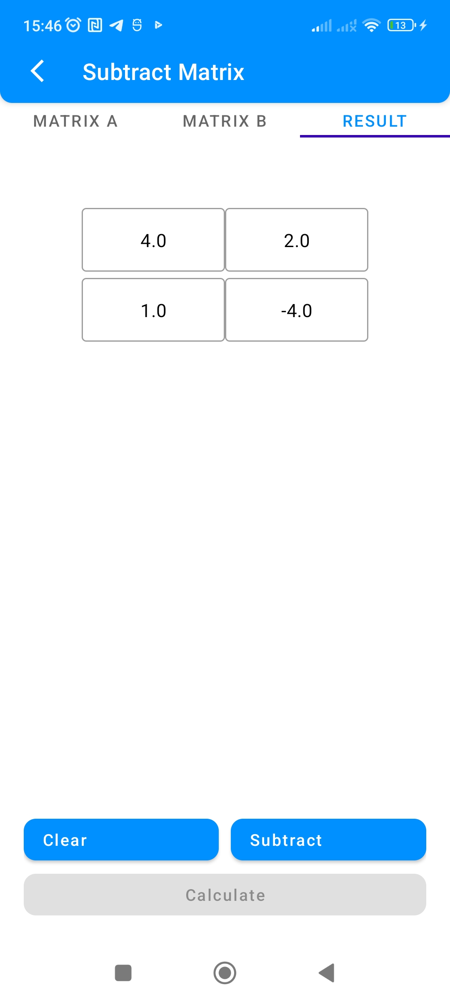

# Calmatrix - Android

A Matrix Calculator App built with Kotlin.

## Screenshots
|  |  |
| :---:                              | :---:                             |
|   |  |
|   |  |

## Todo
- Add Settings
- Add Theme
- Add remaining features (determinant, trace, etc.) 
